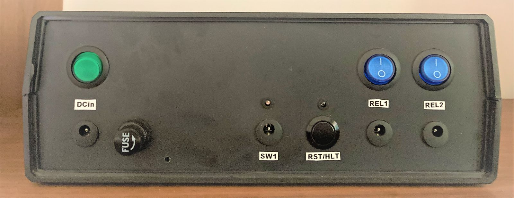
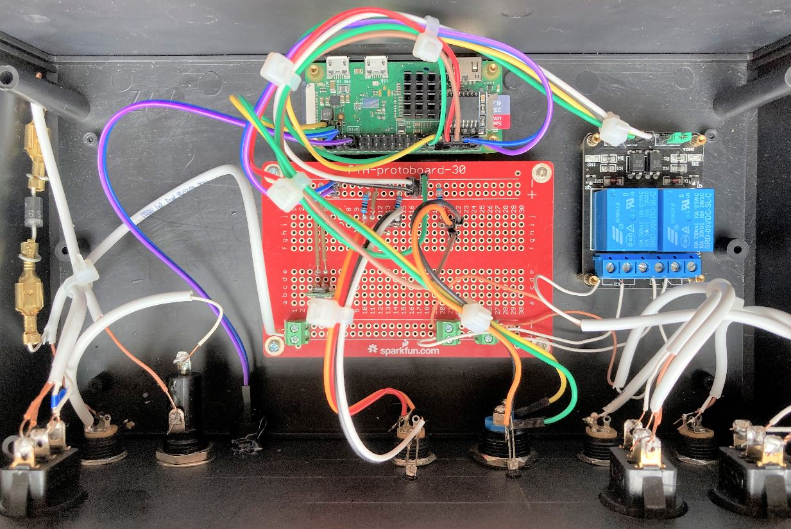

**GardenPi - The Light Controller**

GardenPi is a Raspberry Pi Zero based two channel garden light controller, which includes hardware platform and systemd service written in python. Lights are automatically switched on/off based on calculated sunset time for provided location. Manual lights control is also supported.

**Key Features:**

- two software controlled relay 12V lighting channels with additional mechanical on/off switch (blue)
- main channel designated to control door lighting of the tool house
- secondary channel designated to control lighting of garden feature such as tree or sculpture
- both channels are switched on based on automatically calculated sunset time + predefined delay period
- main channel can be turned on with external on/off door switch as well
- configurable offset period controls delay between activation of main and secondary channel
- period when lights remain turned on can be configured
- controller can be restarted by pressing Reset button
- controller can be shut down by toggling 5x the door switch within 1min interval
- door switch toggles are indicated by a beep.
- number of beeps correspond to the number of toggles, which occurred within 1min shutdown window
- after 1 min interval starting from the first switch on/off, toggle counter is reset to zero
- controller can be turned on and off by the green power switch
- when controller's boot sequence is finished after power on or restart, three short beeps are played 
- marked usb port can be used to ssh to the controller using cli command: ssh pi@gardenpi.local, pwd: raspberry
- wifi module is also configured and can be used whenever 2.4GHz wifi network is available
- real time is preserved at device shutdown using RTC module
- RTC module time is synchronized with network clock as soon as device is connected to LAN via Wi-Fi or USB

**Design and Build Instructions**

HW design has been described in the following files:

* Bill of Materials: 	./doc/gardenpi_bom.txt
* Circuit diagram:		./doc/gardenpi_diagram.pdf
* HW Photos:				./hw/

Pi SW Image preparation process has been documented in the following command log file:

* SW Image Preparations command log: ./doc/gardenpi_cmd.log
* Latest stable SW image can be downloaded from <!-- here -->https://link.com.

Service python script, service file and initial configuration file storing service script settings are all located in:

* Source Code Directory: /src

All Pi configuration files, which were modified as part of this project are stored in:

* Pi Configuration Files: /config