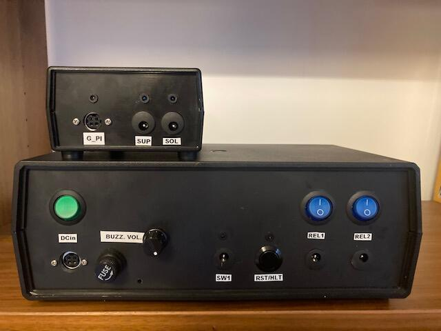

**
GardenPi - The Garden Light Controller
**

GardenPi is a Raspberry Pi Zero based two channel garden light controller, which includes hardware platform and systemd service written in python. Lights are automatically switched on/off based on calculated sunset time for provided location. Manual lights control is also supported.

**Key Features:**

- two software controlled relay 12V lighting channels with additional mechanical on/off switch (blue)
- main channel designated to control door lighting of the tool house
- secondary channel designated to control lighting of garden feature such as tree or sculpture
- both channels are switched on based on automatically calculated sunset time + predefined delay period
- main channel can be turned on with external on/off door switch as well
- configurable offset period controls delay between activation of main and secondary channel
- period when lights remain turned on can be configured
- controller can be restarted by pressing Reset button
- controller can be shut down by toggling 5x the door switch within 1min interval
- door switch toggles are indicated by a beep.
- number of beeps correspond to the number of toggles, which occurred within 1min shutdown window
- after 1 min interval starting from the first switch on/off, toggle counter is reset to zero
- controller can be turned on and off by the green power switch
- when controller's boot sequence is finished after power on or restart, three short beeps are played 
- marked usb port can be used to ssh to the controller using cli command: ssh pi@gardenpi.local, pwd: raspberry
- wifi module is also configured and can be used whenever 2.4GHz wifi network is available
- real time is preserved at device shutdown using RTC module
- RTC module time is synchronized with network clock as soon as device is connected to LAN via Wi-Fi or USB
- Device is powered by 12V DC external power supplier (reversed polarity protection is implemented)

**Design and Build Instructions**

HW design has been described in the following files:

* Bill of Materials: 	./doc/gardenpi_bom.txt
* Circuit diagram:		./doc/gardenpi_diagram.pdf
* HW Photos:				./hw/

Pi SW Image preparation process has been documented in the following command log file:

* SW Image Preparations command log: ./doc/gardenpi_cmd.log
* Latest stable SW image can be downloaded from <!-- here -->https://link.com.

Service python script, service file and initial configuration file storing service script settings are all located in:

* Source Code Directory: ./src

All Pi configuration files, which were modified as part of this project are stored in:

* Pi Configuration Files: ./config

**Initial Configuration**

* Connect GardenPi device to you linux host machine using usb cabel
* From host machine terminal ssh to GardenPi using following commands:
	- ssh pi@gardenpi.local #password is set to: raspberry
* Modify solarcalc.ini  file with unit location information, all other parameters can be left at default.
	- nano ~/PyScripts/SolarCalc/solarcalc.ini
* Halt the device by toggling x5 door switch within 1min interval
* Unplug usb cable, place the device in target location and wire it to lighting and power source.
* If you need access to the list of config files and useful commands type gardenpi command.
* Enjoy the GardenPi device! :-)

**Device Operation**

Device does not require maintenance, if GardenPi operates from location where there is no wifi access its RTC can drift so it is desirable to bring it within wifi coverage from time to time. Such behavior can be expected, but was not observed in real life yet.

**Contributing**

* Fork it!
* Create your feature branch: git checkout -b my-new-feature
* Commit your changes: git commit -am 'Add some feature'
* Push to the branch: git push origin my-new-feature
* Submit a pull request

**Release History**

* Release 1.0 - October 2021 - basic functionality allowing light control
* Release 2.0 - October 2022 - new functionality:
	* device configuration via .ini file, 
	* buzzer support added, 
	* bug fixes focusing on stability (handling of shutdown procedure)
	* gardenpi command and device baner with useful configuration info added

**Planned Functionality**

* External WiFi antenna support
* WiFi configuration using ini file
* Buzzer volume control

Comments or Questions can be directed to: andrzej@mazur.info

